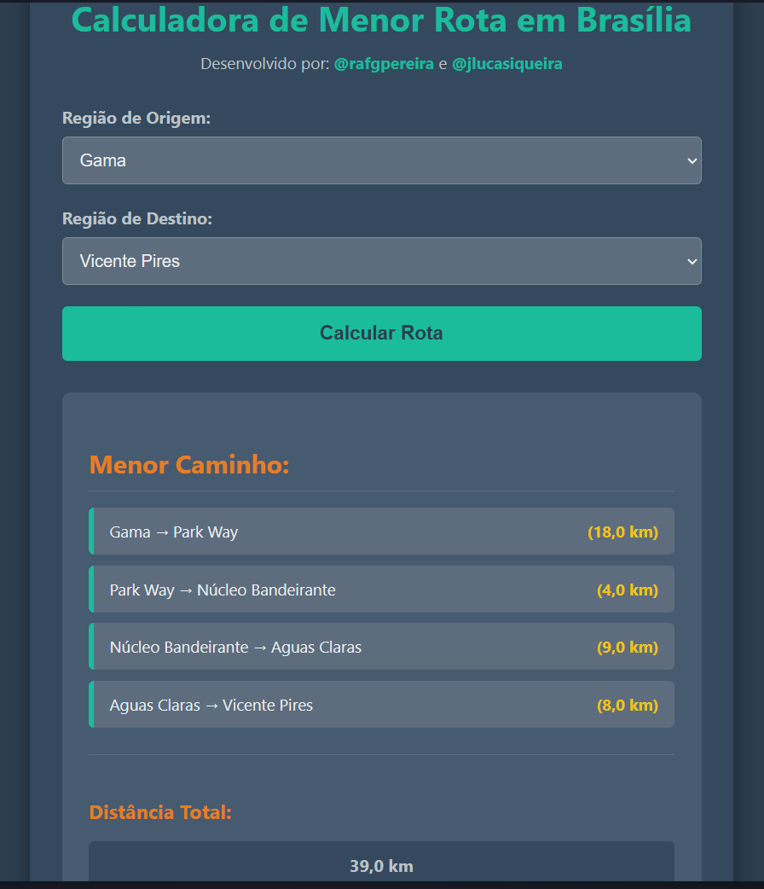
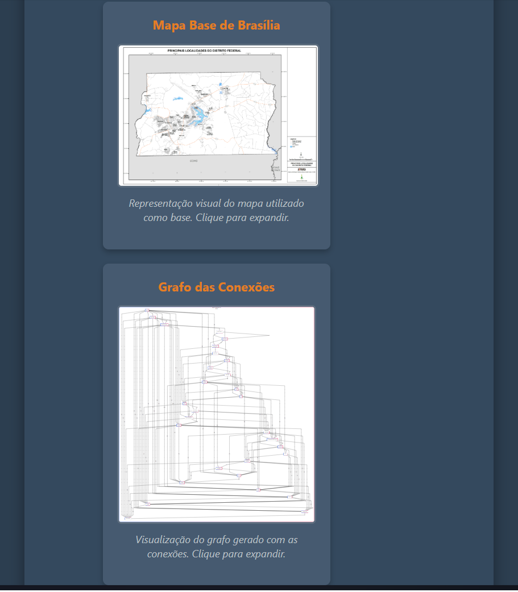

# MENOR DISTÂNCIA - DF

**Número da Lista**: X<br>
**Conteúdo da Disciplina**: Grafos 2<br>

## Alunos

|Matrícula | Aluno |
| -- | -- |
| 222015248  |  Rafael Gomes Pereira |
| 222025324  |  João Lucas Araujo Siqueira |

## Sobre

Este trabalho tem como objetivo implementar o algoritmo de Dijkstra, utilizado para encontrar o menor caminho entre dois vértices em um grafo ponderado. No contexto deste projeto, o algoritmo é aplicado para determinar a rota mais curta entre duas das 31 Regiões Administrativas do Distrito Federal (DF), considerando a malha viária urbana que conecta essas regiões.

O grafo foi construído manualmente, tendo como vértices as Regiões Administrativas e como arestas as conexões diretas entre elas, identificadas por meio de análises em mapas e no Google Maps. Por exemplo, a partir da Ceilândia é possível acessar diretamente, por vias urbanas, as regiões de Taguatinga, Samambaia, Brazlândia, Vicente Pires e Gama.

A solução foi implementada em uma aplicação web interativa, onde o usuário informa a região de origem e a de destino. O sistema, então, aplica o algoritmo de Dijkstra para calcular o menor caminho e retorna a sequência de regiões a serem percorridas, as distâncias entre elas e a distância total do trajeto em quilômetros.

Acesse: [Menor Caminho DF](https://projeto-de-algoritmos-2025.github.io/Grafos2_Menor-Distancia-DF/)

## Screenshots


Grafo que representa as regiões administrativas de Brasília


---



Captura de tela da aplicação web mostrando as funcionalidades


---



Captura de tela das imagens inseridas na aplicação web

---

</center>

## Vídeo de Apresentação

Neste vídeo, apresentamos o trabalho desenvolvido, abordando os principais pontos desenvolvidos ao longo do projeto.

[Assista no Youtube](https://youtu.be/bvvu0p0dONs)

---

## Instalação

### Pré-requisitos

- Git
- Navegador

---

**Linguagem**: Javascript <br>

**Framework**: Não foi utilizado nenhum framework<br>

**Pré-requisitos:** Git e navegador instalados.<br>

Para executar o projeto localmente, basta clonar o repositório e abrir o arquivo _index.html_, que a aplicação será aberta em seu navegador padrão:


```bash
git clone https://github.com/projeto-de-algoritmos-2025/Grafos2_Menor-Distancia-DF.git
```

Para acessar o projeto online, acesse o site:
[Menor Caminho DF](https://projeto-de-algoritmos-2025.github.io/Grafos2_Menor-Distancia-DF/)

---

## Uso

- Clique no campo `Região de Origem` e selecione a região administrativa de onde deseja partir.
- Clique no campo `Região de Destino` e selecione a região administrativa onde deseja chegar.
- Clique em `Calcular Rota` e visualize a descrição completa do melhor caminho e a distancia total abaixo.

## Outros

- Você pode visualizar as imagens do mapa que foi utilizado como base para elaboração do grafo e o grafo desenvolvido rolando para baixo, e clicar para expandi-las.


